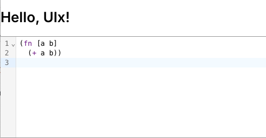

# codemirror-clj

Using CodeMirror-Clojure with UIX.


```CLJS
(defui app []
  (let [[value set-value] (uix/use-state "(fn [a b] (+ a b))")
        onchange (uix/use-callback (fn [val, viewupdate] (set-value val)) [])]
    ($ :div
       ($ :h1 "Hello, UIx!")
       ($ CodeMirror
          {:value value
           :height "200px"
           :extensions
           #js [(.of keymap complete_keymap)
                default_extensions]
           :on-change onchange}))))
```



## Quick setup
```shell
npm i # install NPM deps
npm run dev # run dev build in watch mode with CLJS REPL
```

## Production
```shell
npm run release # build production bundle
```
